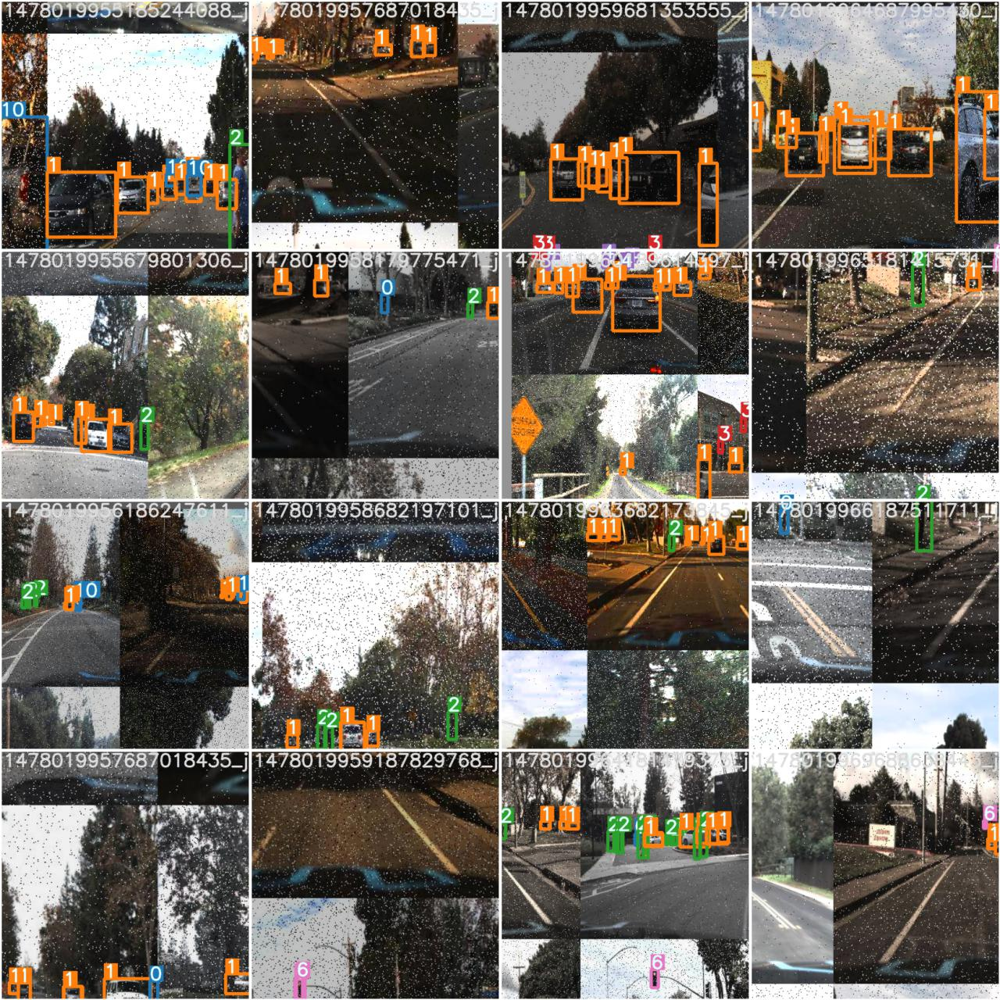

# object-detection-using-yolov5

# YOLOv5 Model Architecture

## Parameters
- Number of Classes (nc): {num_classes}
- Model Depth Multiple (depth_multiple): 0.33
- Layer Channel Multiple (width_multiple): 0.50

## Anchors
- P3/8 Anchors: [10,13, 16,30, 33,23]
- P4/16 Anchors: [30,61, 62,45, 59,119]
- P5/32 Anchors: [116,90, 156,198, 373,326]

## YOLOv5 Backbone
1. P1/2: Focus module with 64 output channels and a 3x3 kernel
2. P2/4: Convolutional layer with 128 output channels, a 3x3 kernel, and a stride of 2
3. BottleneckCSP layer with 128 channels
4. P3/8: Convolutional layer with 256 output channels, a 3x3 kernel, and a stride of 2
5. BottleneckCSP layer with 256 channels
6. P4/16: Convolutional layer with 512 output channels, a 3x3 kernel, and a stride of 2
7. BottleneckCSP layer with 512 channels
8. P5/32: Convolutional layer with 1024 output channels, a 3x3 kernel, and a stride of 2
9. SPP module with 1024 channels and pool sizes [5, 9, 13]
10. BottleneckCSP layer with 1024 channels (no downsampling)

## YOLOv5 Head
1. Convolutional layer with 512 output channels and a 1x1 kernel
2. Upsampling layer with a factor of 2 (nearest neighbor interpolation)
3. Concatenate the P4 feature map from the backbone
4. BottleneckCSP layer with 512 channels
5. Convolutional layer with 256 output channels and a 1x1 kernel
6. Upsampling layer with a factor of 2 (nearest neighbor interpolation)
7. Concatenate the P3 feature map from the backbone
8. BottleneckCSP layer with 256 channels (P3/8-small)
9. Convolutional layer with 256 output channels, a 3x3 kernel, and a stride of 2
10. Concatenate the P4 feature map from the head
11. BottleneckCSP layer with 512 channels (P4/16-medium)
12. Convolutional layer with 512 output channels, a 3x3 kernel, and a stride of 2
13. Concatenate the P5 feature map from the head
14. BottleneckCSP layer with 1024 channels (P5/32-large)
15. Detect layer with parameters: Number of Classes (nc) and Anchors

# Results

<!-- add image in markdown -->
